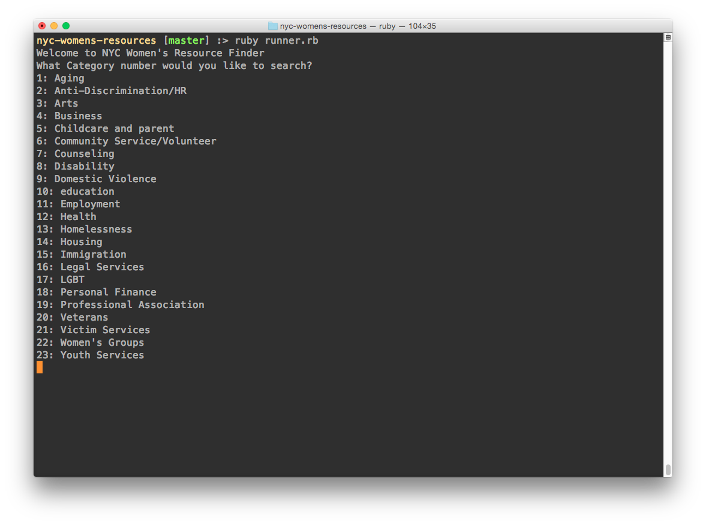
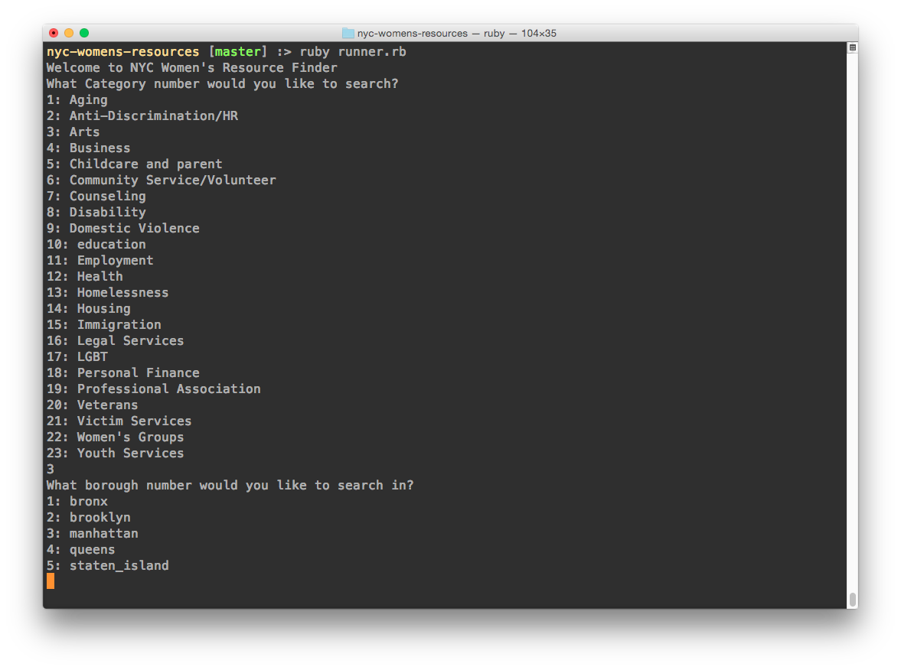
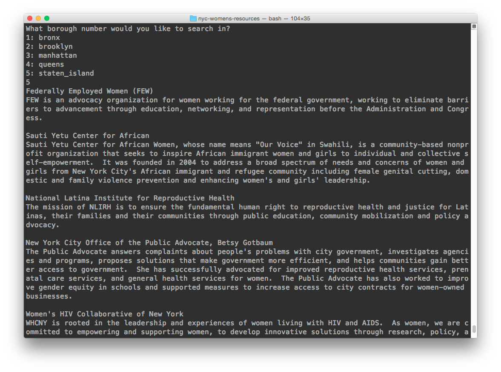

# NYC Womens Resources
NYC Womens Resources is a simple command line application built with fellow students at Dev Bootcamp.

It pulls from an [NYC Open Data set](https://data.cityofnewyork.us/Social-Services/NYC-Women-s-Resource-Network-Database/pqg4-dm6b) and allows the user to search for women's resources by category and borough.

To run this app, clone this directory and use the command `ruby runner.rb` in your terminal.

#Screenshots
## Run the app

## Choose a category

## Choose a borough

